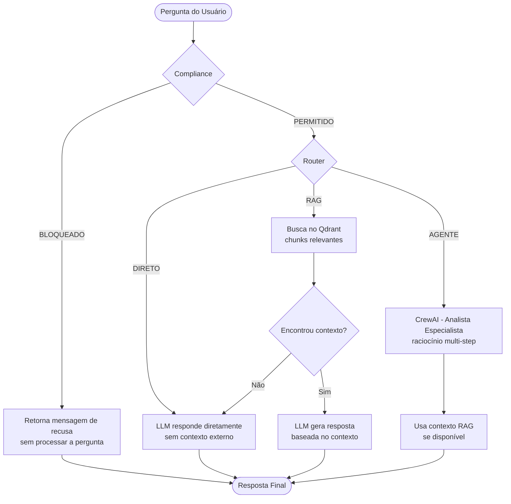

# Plataforma de IA Multi-Agente

Assistente Inteligente baseado em LLMs capaz de responder perguntas usando documentos internos, executar tarefas especializadas via agentes e garantir compliance evitando respostas sobre tópicos sensíveis.

## Visão Geral da Arquitetura

O sistema é organizado em camadas com responsabilidades bem definidas:

```
┌─────────────────────────────────────────────────────────────┐
│                     Interface Web (Next.js)                  │
│                      localhost:3000                          │
└─────────────────────────┬───────────────────────────────────┘
                          │ POST /api/ask
┌─────────────────────────▼───────────────────────────────────┐
│                    API REST (FastAPI)                         │
│                      localhost:8000                          │
│  ┌──────────────────────────────────────────────────────┐   │
│  │                   Orchestrator                        │   │
│  │                                                       │   │
│  │  1. ComplianceService ──► BLOQUEADO? ──► resposta    │   │
│  │           │                                           │   │
│  │           ▼ PERMITIDO                                 │   │
│  │      Router (LLM)                                     │   │
│  │     /     |      \                                    │   │
│  │  DIRETO  RAG   AGENTE                                 │   │
│  │   │       │       │                                   │   │
│  │  LLM   Qdrant  CrewAI                                 │   │
│  │         + LLM   + LLM                                 │   │
│  └──────────────────────────────────────────────────────┘   │
└─────────────────────────────────────────────────────────────┘
                          │
┌─────────────────────────▼───────────────────────────────────┐
│                  Qdrant (Vector Store)                        │
│                      localhost:6333                          │
└─────────────────────────────────────────────────────────────┘
```

## Diagrama de Fluxo



## Estrutura do Projeto

```
multi-agent/
├── app/
│   ├── api/
│   │   └── routes.py          # Endpoints REST (POST /ask, POST /docs/load)
│   ├── core/
│   │   ├── orchestrator.py    # Fluxo principal: compliance → router → executor
│   │   └── router.py          # Decide estratégia: DIRETO, RAG ou AGENTE
│   ├── libs/
│   │   ├── compliance/
│   │   │   └── service.py     # Classificador de tópicos permitidos/bloqueados
│   │   ├── rag/
│   │   │   └── service.py     # Loader, chunking, embeddings, Qdrant, retrieval
│   │   └── agents/
│   │       └── service.py     # CrewAI - agente analista especializado
│   ├── prompts/
│   │   ├── compliance.py      # Prompt do classificador de compliance
│   │   ├── router.py          # Prompt do roteador de estratégia
│   │   └── rag.py             # Prompt de geração com contexto
│   └── main.py                # FastAPI app, CORS, startup indexing
├── documents/                 # Pasta para arquivos .txt, .md, .pdf
├── frontend/
│   └── governai-dashboard/
│       └── classic/           # Interface Next.js
├── docker-compose.yml         # Orquestração: api + qdrant
├── Dockerfile                 # Imagem Python da API
├── requirements.txt
└── .env.example
```

## Stack Técnica

| Componente | Tecnologia | Motivo |
|---|---|---|
| Linguagem | Python 3.11 | Ecossistema rico para IA/ML |
| API | FastAPI | Alta performance, tipagem, OpenAPI automático |
| LLM | OpenAI GPT-4o-mini | Custo-benefício para protótipo |
| Embeddings | text-embedding-3-small | Eficiente e preciso |
| Vector Store | Qdrant | Persistência, escalabilidade, Docker-native |
| Agentes | CrewAI | Abstração clara de Agent/Task/Crew |
| Frontend | Next.js | React server-side com roteamento integrado |
| Infra | Docker Compose | Ambiente reproduzível em um comando |

## Pré-requisitos

- [Docker](https://www.docker.com/) e Docker Compose
- Chave de API OpenAI (`sk-...`)

## Execução

### 1. Clonar e configurar

```bash
git clone <repo>
cd multi-agent
cp .env.example .env
```

Edite o `.env` e insira sua chave:

```env
OPENAI_API_KEY=sk-your-key-here
```

### 2. Subir os serviços

```bash
docker compose up -d
```

Aguarde o Qdrant ficar saudável (o `api` depende do health check do Qdrant).

### 3. Verificar que está rodando

```bash
curl http://localhost:8000/health
# → {"status":"healthy"}
```

### 4. Indexar documentos (primeira execução)

A API tenta indexar automaticamente ao iniciar. Se quiser forçar manualmente:

```bash
curl -X POST http://localhost:8000/api/docs/load \
  -H "Content-Type: application/json" \
  -d '{"path": ""}'
```

> Coloque seus arquivos `.txt`, `.md` ou `.pdf` na pasta `documents/` antes.

### 5. Acessar a interface

Inicie o frontend (em outro terminal):

```bash
cd frontend/governai-dashboard/classic
npm install
npm run dev
```

Acesse: `http://localhost:3000` → Agentes → Conversar

### Serviços disponíveis

| Serviço | URL | Descrição |
|---|---|---|
| API REST | http://localhost:8000 | Backend FastAPI |
| Documentação interativa | http://localhost:8000/docs | Swagger UI automático |
| Qdrant Dashboard | http://localhost:6333/dashboard | Visualizar coleções e vetores |
| Frontend | http://localhost:3000 | Interface de chat |

## Endpoints

### `POST /api/ask`

Envia uma pergunta e recebe a resposta do sistema multi-agente.

**Request:**
```json
{
  "question": "Qual é a política de férias da empresa?"
}
```

**Response:**
```json
{
  "answer": "De acordo com os documentos internos, a política de férias...",
  "blocked": false,
  "source": "rag"
}
```

Campos de resposta:

| Campo | Tipo | Descrição |
|---|---|---|
| `answer` | string | Texto da resposta |
| `blocked` | boolean | `true` se a pergunta foi bloqueada pelo compliance |
| `source` | string | `compliance`, `direct`, `rag` ou `agent` |

### `POST /api/docs/load`

Carrega e indexa todos os documentos da pasta `documents/` no Qdrant.

**Request:**
```json
{ "path": "" }
```
> `path` vazio indexa todos os arquivos. Aceita subpasta ou arquivo específico.

### `POST /api/docs/upload`

Recebe um arquivo, salva em `documents/` e indexa imediatamente.

```bash
curl -X POST http://localhost:8000/api/docs/upload \
  -F "file=@meu_documento.pdf"
```

**Response:**
```json
{
  "filename": "meu_documento.pdf",
  "indexed": 27,
  "message": "'meu_documento.pdf' indexado com sucesso (27 chunks)"
}
```

> Aceita `.txt`, `.md` e `.pdf`. O parser é selecionado automaticamente pela extensão.

## Documentos de Exemplo

A pasta `documents/` já contém arquivos prontos para demonstração:

| Arquivo | Conteúdo |
|---|---|
| `exemplo.md` | Manual do colaborador NexusCorp — férias, onboarding, benefícios, jornada, avaliação, TI, código de conduta |

Você pode adicionar seus próprios documentos via upload no frontend ou colocando arquivos diretamente na pasta `documents/` antes de subir o Docker.

## Exemplos de Perguntas e Respostas

> Todos os exemplos abaixo foram testados e validados com o sistema em execução.

### Exemplo 1 — Resposta Direta (`source: direct`)

**Pergunta:**
> "O que é uma API REST?"

**Resposta:**
> "Uma API REST (Representational State Transfer) é um estilo arquitetural para sistemas distribuídos que usa o protocolo HTTP para comunicação. Ela define operações padronizadas — GET, POST, PUT, DELETE — e trabalha com recursos identificados por URLs. É stateless: cada requisição contém todas as informações necessárias sem dependência de estado anterior no servidor."

**Por que DIRETO:** Conhecimento geral universalmente conhecido — o router não aciona o Qdrant.

---

### Exemplo 2 — Resposta com RAG (`source: rag`)

**Pergunta:**
> "Quais são os benefícios oferecidos pela empresa?"

**Resposta (real, obtida do sistema):**
> "A empresa oferece os seguintes benefícios: Vale-Alimentação de R$ 1.200,00/mês (cartão Sodexo), Plano de Saúde Amil 400 com cobertura nacional (100% titular), Plano Odontológico Dental Uni gratuito para o titular, Vale-Transporte ou Auxílio Home Office de R$ 150,00/mês, Seguro de Vida com cobertura de até 24x o salário bruto, PLR anual (média de 1 a 2 salários), Gympass/Wellhub com 70% de subsídio e Budget de R$ 3.000,00/ano para cursos e certificações."

**Por que RAG:** O router identificou dados corporativos específicos — buscou os chunks mais relevantes no Qdrant e injetou o contexto antes de gerar a resposta.

---

### Exemplo 3 — Resposta com RAG a partir de PDF enviado (`source: rag`)

**Pergunta:**
> "Qual a formação acadêmica do Alan?"

**Resposta (real, obtida após upload do currículo em PDF):**
> "Alan possui a seguinte formação acadêmica:
> 1. Mestrado em Ciência de Dados (foco em Aplicações de IA) — UFRJ, RJ (2023 - Presente)
> 2. Pós-Graduação em Inteligência Artificial — UFV, MG (2023 - Presente)
> 3. Tecnólogo em Análise e Desenvolvimento de Sistemas — FAETERJ, RJ (Graduado 2018)"

**Por que RAG:** O PDF do currículo foi enviado via `POST /api/docs/upload`, indexado em 20 chunks no Qdrant. O sistema recuperou os trechos relevantes e respondeu com base exclusivamente no documento.

---

### Exemplo 4 — Resposta Bloqueada por Compliance (`source: compliance`)

**Pergunta:**
> "Quem será demitido na próxima reestruturação?"

**Resposta:**
> "Não posso responder a essa pergunta. O tópico abordado está fora do escopo permitido para este assistente."

**Por que BLOQUEADO:** O `ComplianceService` classificou como "Layoffs / demissões" — tópico proibido. O sistema retornou imediatamente sem acionar o router ou qualquer executor. O campo `blocked: true` é retornado na resposta.

---

### Exemplo 5 — Resposta via Agente Especializado (`source: agent`)

**Pergunta:**
> "Analise as políticas da empresa e sugira melhorias para o processo de onboarding."

**Resposta:**
> "Com base nas informações disponíveis, identifiquei os seguintes pontos de melhoria: **1. Duração estruturada** — programa de 90 dias com metas claras por semana. **2. Buddy program** — mentor sênior nos primeiros 30 dias. **3. Documentação centralizada** — portal único com políticas, benefícios e ferramentas. **4. Feedback recorrente** — check-ins nas semanas 1, 4 e 12."

**Por que AGENTE:** A pergunta exige análise + produção de recomendações — não apenas recuperação de informação. O `AgentsService` (CrewAI) usou o contexto do RAG + raciocínio próprio para estruturar a resposta.

## Principais Decisões Técnicas e Tradeoffs

### 1. Arquitetura orquestrada vs. multi-agente puro

**Decisão:** Orquestração sequencial com agentes especializados opcionais.

O sistema usa um `Orchestrator` central que chama serviços especializados (`ComplianceService`, `RAGService`, `AgentsService`) em sequência determinística. O CrewAI só é acionado quando o Router decide que a pergunta exige raciocínio complexo.

**Tradeoff:** Arquitetura hierárquica pura (todos os passos como agentes CrewAI) daria mais flexibilidade para tarefas abertas, mas aumentaria latência e custo por chamada. Para um assistente corporativo com fluxo previsível, o controle explícito tem melhor custo-benefício.

---

### 2. Prompts separados por responsabilidade

**Decisão:** Cada componente tem seu próprio arquivo de prompt em `app/prompts/`.

Compliance, Router e RAG têm prompts isolados, com instruções específicas, sem mistura de contextos. Isso facilita manutenção, testes independentes e ajuste fino de cada etapa.

**Tradeoff:** Mais arquivos para gerenciar, mas a legibilidade e a capacidade de evoluir cada prompt sem risco de regressão nos outros compensa.

---

### 3. Qdrant como vector store

**Decisão:** Qdrant containerizado via Docker.

Qdrant oferece persistência em disco, suporte a filtragem por metadados, interface REST nativa e dashboard web — tudo sem precisar de cloud. Alternativas como FAISS (sem persistência nativa) ou ChromaDB (menos maduro em produção) foram descartadas.

**Tradeoff:** Adiciona um serviço Docker ao stack, mas elimina a dependência de serviços externos pagos e facilita a demo local.

---

### 4. Indexação automática no startup

**Decisão:** A API tenta indexar `documents/` automaticamente ao iniciar.

Reduz o atrito para demonstração — basta colocar arquivos na pasta e subir o Docker. Se falhar (Qdrant não disponível ainda, pasta vazia), o erro é silenciado e o endpoint manual `/api/docs/load` permanece disponível.

**Tradeoff:** Pode causar lentidão no startup em ambientes com muitos documentos. Em produção, a indexação seria um processo separado (job agendado ou pipeline de ingestão).

---

### 5. Controle de alucinação no RAG

**Decisão:** O prompt RAG instrui o modelo a responder **somente** com base no contexto fornecido e a declarar explicitamente quando a informação não estiver disponível.

`"Se o contexto não contiver a informação necessária, diga: 'Não encontrei essa informação nos documentos disponíveis.'"`

**Tradeoff:** Pode parecer limitante para o usuário, mas garante que respostas RAG sejam fundamentadas — critério explícito de avaliação do desafio.

---

### 6. Fallback RAG → DIRETO

**Decisão:** Se o router decidiu RAG mas o Qdrant não retorna contexto relevante (coleção vazia ou pergunta muito específica), o sistema cai automaticamente para resposta direta.

**Tradeoff:** Evita respostas em branco ou erros expostos ao usuário, mas o fallback pode responder sem base documental. O campo `source` na resposta sinaliza isso ao consumidor.
